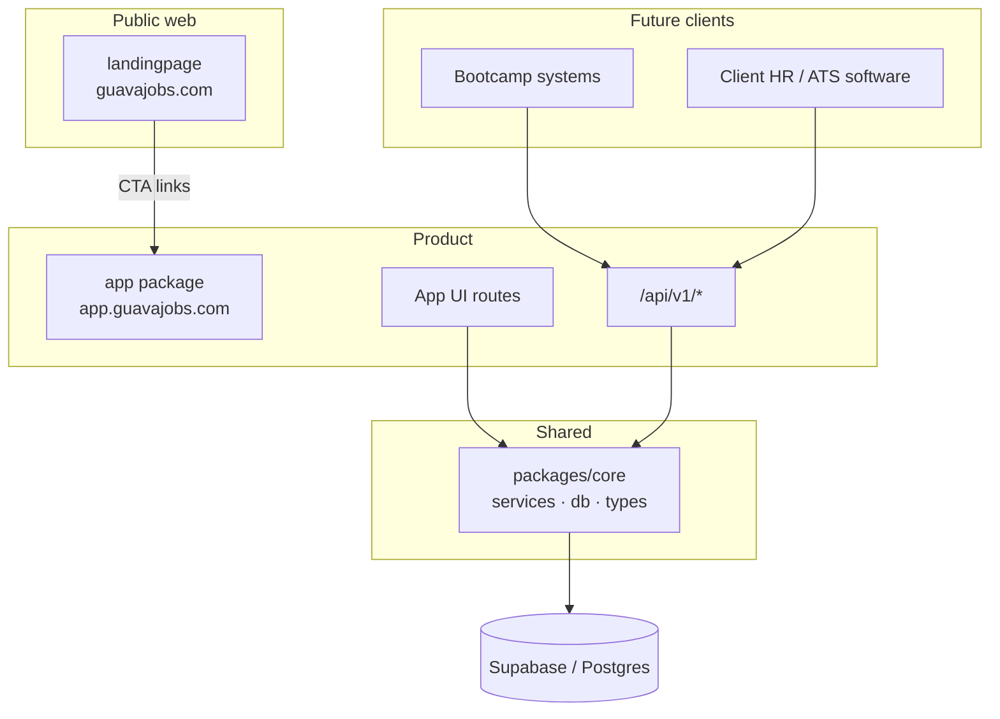

created_date: 2026-05-30 19:00:00, updated_at: 2026-05-31 10:30:00

# GuavaJobs — Architecture

## Overview

GuavaJobs runs as a **monorepo** with **two independently deployed Next.js applications** and a **shared core package** for all backend logic. This split keeps marketing fast and SEO-focused while the product app owns auth, data, jobs, tracker, AI, and the **public REST API** for future B2B integrations.



---

## Repository layout

```
GuavaJobs.com–Ai-job-assist/
├── landingpage/          → guavajobs.com (port 3000 local)
├── app/                  → app.guavajobs.com (port 3001 local)
├── packages/
│   └── core/             → @guavajobs/core (no HTTP — import only)
├── projectVision.md
├── masterBuildPlan.md
└── architecture.md
```

### landingpage (`guavajobs.com`)

- **Marketing only:** hero, features, pricing, legal, blog/SEO later.
- **No product database access.** No Supabase service role, no Prisma client.
- All product CTAs use `NEXT_PUBLIC_APP_URL` → `https://app.guavajobs.com`.
- Example links: `/jobs`, `/sign-up`, `/pricing` on the **app** domain.

### app (`app.guavajobs.com`)

- **Product UI:** job board, auth, profile, tracker, cover letters, dashboard, billing.
- **Canonical REST API** at `/api/v1/*` for the same domain.
- Route Handlers are **thin HTTP adapters** — they validate input, authenticate, call `@guavajobs/core` services, return JSON.
- **Product UI must use the service layer** (`@guavajobs/core`), not duplicate business logic in page components. External clients use HTTP; internal UI calls services directly (same code path as API).

### packages/core (`@guavajobs/core`)

Shared backend — imported by **`app/` only** (not `landingpage/`):

| Folder | Responsibility |
|--------|----------------|
| `services/` | Business logic: applications, profile, cover letters, jobs, usage, billing |
| `db/` | Prisma client or Supabase data access |
| `validators/` | Zod schemas shared by API + server actions |
| `types/` | DTOs, enums (application status, tiers, etc.) |
| `auth/` | Session helpers, future API key validation for partners |

---

## API-first rules (V1 onward)

1. **Every backend feature** gets a service in `packages/core` **before** (or alongside) UI.
2. **Every user-facing backend feature** exposes a **versioned** REST route: `/api/v1/<resource>`.
3. **Route handlers** do only: parse request → auth → validate → call service → map response / errors.
4. **No business logic** in React components or Route Handler files beyond orchestration.
5. **Breaking changes** require a new API version (`/api/v2`); never break `/api/v1` for integrated clients.

### Planned V1 API surface (app.guavajobs.com)

| Method | Route | Purpose |
|--------|-------|---------|
| GET | `/api/v1/health` | Liveness check |
| GET/POST | `/api/v1/jobs` | Search/list jobs (Adzuna proxy) |
| GET | `/api/v1/jobs/:id` | Job detail |
| GET/PATCH | `/api/v1/profile` | User profile |
| GET/POST/PATCH/DELETE | `/api/v1/applications` | Application tracker |
| GET/POST/PATCH | `/api/v1/applications/:id/cover-letters` | Manual + AI letters |
| POST | `/api/v1/cover-letters/generate` | AI generation (quota enforced) |
| GET | `/api/v1/usage` | AI quota remaining |
| POST | `/api/v1/webhooks/stripe` | Billing webhooks |

**Future (B2B integrations):** Partner auth via `Authorization: Bearer <api_key>` on scoped routes (e.g. read applications for bootcamp cohort, trigger letter generation). Stub `Partner` + `ApiKey` models in planning; implement when first client signs.

### API JSON contract (`@guavajobs/core`)

Implemented in [`packages/core/src/api/`](packages/core/src/api/). App Route Handlers import `toErrorResponse`, `toSuccessResponse`, `ApiErrorCode`, and `API_ERROR_STATUS`.

**Success (2xx):**

```json
{ "data": { } }
```

**Error (4xx/5xx):**

```json
{
  "error": {
    "code": "VALIDATION_ERROR",
    "message": "Human-readable message",
    "details": {}
  }
}
```

| `ApiErrorCode` | HTTP status | When |
|----------------|-------------|------|
| `VALIDATION_ERROR` | 400 | Zod / input validation failed |
| `UNAUTHORIZED` | 401 | Missing or invalid session |
| `FORBIDDEN` | 403 | Authenticated but not allowed |
| `QUOTA_EXCEEDED` | 403 | AI letter limit reached (freemium) |
| `NOT_FOUND` | 404 | Resource missing |
| `INTERNAL_ERROR` | 500 | Unexpected server error |

**F1.5:** `GET /api/v1/health` returns `{ "data": { "status": "ok", "version": "v1" } }` via `toSuccessResponse` in `app/src/app/api/v1/health/route.ts`.

---

## app package internal structure (target)

```
app/                              # monorepo package (deploy root on Vercel)
├── src/
│   ├── app/                      # Next.js App Router (framework convention)
│   │   ├── (auth)/                 # sign-in, sign-up, reset
│   │   ├── (dashboard)/            # tracker, profile, settings
│   │   ├── jobs/                   # Public job board UI
│   │   └── api/
│   │       └── v1/
│   │           ├── health/
│   │           ├── jobs/
│   │           ├── profile/
│   │           ├── applications/
│   │           ├── cover-letters/
│   │           ├── usage/
│   │           └── webhooks/
│   ├── components/
│   └── lib/
│       └── api/                    # HTTP helpers: error format, auth wrapper
├── package.json
└── README.md
```

---

## Authentication model

| Consumer | Auth mechanism |
|----------|----------------|
| **Browser (App UI)** | Supabase session cookies; server components read session |
| **App UI → own API** | Session cookie on same origin, or direct service calls (preferred for RSC) |
| **External client (future)** | API keys or OAuth client credentials; rate limits per partner |

---

## Environment variables

### landingpage

| Variable | Example |
|----------|---------|
| `NEXT_PUBLIC_APP_URL` | `https://app.guavajobs.com` |
| `NEXT_PUBLIC_SITE_URL` | `https://guavajobs.com` |

### app (product package)

| Variable | Example |
|----------|---------|
| `NEXT_PUBLIC_APP_URL` | `https://app.guavajobs.com` |
| `NEXT_PUBLIC_LANDING_URL` | `https://guavajobs.com` |
| `DATABASE_URL` | Supabase Postgres |
| `SUPABASE_*` | Auth + storage |
| `ADZUNA_*` | Job feed |
| `OPENAI_API_KEY` / etc. | AI provider |
| `STRIPE_*` | Billing |

---

## Deployment

| Vercel project | Root directory | Domain |
|----------------|----------------|--------|
| guavajobs-marketing | `landingpage` | guavajobs.com |
| guavajobs-app | `app` | app.guavajobs.com |

CORS: Public API routes allow configured partner origins when B2B launches; default same-origin for V1.

---

## Cross-app user journey

1. User lands on **guavajobs.com** (`landingpage/`).
2. Clicks **Browse jobs** → `app.guavajobs.com/jobs` (public, no auth).
3. Clicks **Track this job** → sign-up on **app** → draft application created via `applicationService`.
4. Bootcamp HR tool (later) → `POST app.guavajobs.com/api/v1/...` with API key.

---

## Document changelog

| Date | Change |
|------|--------|
| 2026-05-30 | Initial architecture: dual Next.js apps, packages/core, API-first V1 surface |
| 2026-05-30 | Renamed packages to lowercase: `landingpage/`, `app/` |
| 2026-05-31 | Documented API JSON contract (`@guavajobs/core/api`) |
