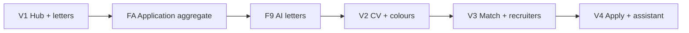

created_date: 2026-05-30 18:30:00, updated_at: 2026-06-02 12:00:00

# GuavaJobs — Master Build Plan

> Living execution doc. Tick `- [x]` when a phase is **done and verified**.  
> Product spec: [`projectVision.md`](./projectVision.md) · Architecture: [`architecture.md`](./architecture.md)

---

## Repository architecture (two apps + API core)

| Folder | Domain | Role |
|--------|--------|------|
| **`landingpage/`** | guavajobs.com | Marketing, pricing, legal, SEO — **no product DB** |
| **`app/`** | app.guavajobs.com | Product UI + **REST API** `/api/v1/*` |
| **`packages/core/`** | — | Shared services, DB, validators — **all backend logic** |

**API-first rule:** Every backend feature = service in `@guavajobs/core` + HTTP route in `app/src/app/api/v1/` (for external clients and consistent boundaries). App UI calls services directly; Route Handlers stay thin.

---

## How to use this plan

1. **Build in the recommended order** below—later features depend on earlier ones.
2. **One phase at a time.** Do not skip ahead unless the dependency is truly optional.
3. **Tick only when complete:** code works locally, edge case considered, UI not broken on mobile.
4. **V1 is fully phased.** V2–V4 list features with phase *hints*—expand into full phases when that version starts.
5. Update **Progress snapshot** at the bottom when you tick items.

---

## Recommended V1 build order

```
1. Monorepo + packages/core + API conventions     (F1)
2. Auth & accounts                                (F2) — App only
3. Landing page                                   (F3) — landingpage/
4. Public job board + /api/v1/jobs                (F4) — app/
5. Sign-up gate & protected routes                (F5) — app/
6. User profile & quiz + /api/v1/profile          (F6) — app/
7. Application tracker + /api/v1/applications     (F7) — app/
8. Manual cover letters + API                     (F8) — app/
8b. Application aggregate foundation              (FA) — core + app/ (before F9)
9. AI cover letters + API                         (F9) — app/ (requires FA.1–FA.2)
10. AI usage limits + /api/v1/usage               (F10) — app/
11. Payments + webhooks                           (F11) — app/
12. Compliance (split) + launch prep              (F12) — both apps
```

---

## V1 — Career hub MVP (detailed phases)

**V1 goal:** Public job board → sign up at apply → unlimited tracker + manual letters → 5 AI letters/month (no card).

---

### F1 — Monorepo, dual apps & API foundation

| Status | Phase | Scope |
|--------|-------|-------|
| - [x] | **F1.1** | Root monorepo: npm workspaces; folders `landingpage/`, `app/`, `packages/core/`; root [`README.md`](./README.md). |
| - [x] | **F1.2** | **`packages/core`**: scaffold `services/`, `db/`, `validators/`, `types/`, `auth/`; export from `index.ts`; no React/HTTP inside core. |
| - [x] | **F1.3** | **API conventions** in `@guavajobs/core/api` + [`architecture.md`](./architecture.md). Health route → F1.5. |
| - [x] | **F1.4** | **`landingpage/`**: v0 wired — env CTAs, legal stubs, build hygiene (see F1.4 notes in changelog). |
| - [x] | **F1.5** | **`app/`**: Init Next.js + TypeScript + Tailwind + shadcn/ui; depend on `@guavajobs/core`; port **3001** locally. |
| - [x] | **F1.6** | **landingpage** layout: header, footer, mobile nav; `NEXT_PUBLIC_APP_URL` for all product CTAs. |
| - [x] | **F1.7** | **app** layout: header, footer, mobile nav; `NEXT_PUBLIC_LANDING_URL` for marketing links. |
| - [x] | **F1.8** | **Supabase + Prisma** wired in `packages/core/db` only (single DB access point). |
| - [x] | **F1.9** | **Vercel**: two projects — `landingpage` → guavajobs.com; `app` → app.guavajobs.com; env vars per project. |
| - [x] | **F1.10** | Shared UX patterns in **app**: loading skeletons, empty states, toasts; landingpage marketing component set. |

---

### F2 — Auth & accounts (`app/`)

| Status | Phase | Scope |
|--------|-------|-------|
| - [x] | **F2.1** | Supabase Auth: email + password sign-up and sign-in pages on **app.guavajobs.com**. |
| - [x] | **F2.2** | OAuth optional stub (Google)—skip if not needed for V1 launch. |
| - [x] | **F2.3** | Session handling: server/client auth helpers; redirect after login. |
| - [x] | **F2.4** | **No payment details** on sign-up—confirm signup form has no Stripe/card fields. |
| - [x] | **F2.5** | Password reset flow (email link via Supabase). |
| - [x] | **F2.6** | Account settings page: email display, sign out, **delete account** (GDPR). |
| - [x] | **F2.7** | On first login: create/link app `User` row in DB via **`packages/core`** (sync with auth id). |

---

### F3 — Landing page (`landingpage/` → guavajobs.com)

| Status | Phase | Scope |
|--------|-------|-------|
| - [x] | **F3.1** | Public route `/` on **landingpage** — hero: hub positioning (track applications + career progression). |
| - [x] | **F3.2** | ICP-focused copy: UK/DE bootcamp grads & tech career changers; English, Professional tone. |
| - [x] | **F3.3** | Value blocks: free tracker, 5 AI letters/month, no credit card; grounded AI mention. |
| - [x] | **F3.4** | Hero job search (GET → app `/jobs`); self-contained Lucide hero bar; junior placeholder; carousel never empty. |
| - [x] | **F3.5** | Social proof placeholder (testimonials / “how it works” 3-step strip). |
| - [x] | **F3.6** | Footer: Privacy, Terms, contact; link to app; no Adzuna attribution here (jobs live on App). |
| - [x] | **F3.7** | Mobile-responsive polish; Lighthouse pass on performance/accessibility basics. |

---

### F4 — Public job board (`app/` + Adzuna + API)

| Status | Phase | Scope |
|--------|-------|-------|
| - [x] | **F4.1** | **`jobsService`** in core: Adzuna fetch wrapper, error handling, rate-limit awareness. |
| - [x] | **F4.2** | DB model: `JobListing` cache (optional) or pass-through—decide cache TTL for performance. |
| - [x] | **F4.3** | **`GET /api/v1/jobs`** — search, pagination (public). |
| - [x] | **F4.4** | **`GET /api/v1/jobs/:id`** — job detail (public). |
| - [x] | **F4.5** | App UI: public **`/jobs`** — search, filters, full-viewport board, geo redirect on bare `/jobs`. |
| - [x] | **F4.6** | App UI: public **`/jobs/[id]`** — full description, company, location, salary. |
| - [x] | **F4.7** | Empty / error states: no results, API down, invalid job id. |
| - [x] | **F4.8** | Adzuna **attribution** on App job pages per API terms. |
| - [x] | **F4.9** | **Track / Apply with GuavaJobs** button on detail page (wired in F5). |
| - [x] | **F4.10** | SEO on **App** job pages: metadata, canonical URLs (app.guavajobs.com/jobs/…). |

---

### F5 — Sign-up gate & protected routes (`app/`)

| Status | Phase | Scope |
|--------|-------|-------|
| - [x] | **F5.1** | Middleware or route guards: public vs auth-required routes documented. |
| - [x] | **F5.2** | Click **Track / Apply** on job → redirect to sign-in/up with `next` to complete action. |
| - [x] | **F5.3** | Post-auth callback: auto-create **draft application** from job (Adzuna id + title + company + description snapshot). |
| - [x] | **F5.4** | Protected `/dashboard` (tracker home) — auth required. |
| - [x] | **F5.5** | Protected `/profile` — auth required. |
| - [x] | **F5.6** | Manual job entry form (when job not on Adzuna): title, company, description URL or paste → draft application. |

---

### F6 — User profile & quiz (`app/` + API)

| Status | Phase | Scope |
|--------|-------|-------|
| - [x] | **F6.1** | DB models + **`profileService`** in core: summary, skills, education. |
| - [x] | **F6.2** | Profile form: experience entries (role, company, dates, bullets). |
| - [x] | **F6.3** | Skills tags + education section. |
| - [x] | **F6.4** | Short **job preference quiz** (stored for future matching): role type, remote/hybrid, priorities. |
| - [x] | **F6.5** | Paste CV/LinkedIn **text** into profile helper (no scraping)—split into fields manually or simple parser. |
| - [x] | **F6.6** | Optional CV **file upload** (Supabase storage)—store file; parsing deferred to V2. |
| - [x] | **F6.7** | Profile completeness indicator; prompt before first AI letter if profile too empty. |
| - [x] | **F6.8** | Edit/save with validation; success and error feedback. |
| - [x] | **F6.9** | **`GET/PATCH /api/v1/profile`** — auth required; delegates to `profileService`. |

---

### F7 — Application tracker (`app/` + API)

> **Unified execution plan (job board UX + F7):** `.cursor/plans/job_board_ux_redesign_87e19803.plan.md`  
> Build order there: F4 filters/board → **F7 core + API** → dashboard expandable rows + `/applications/[id]` → landing hero → saved searches.  
> **Already done:** Prisma `Application` + enum, `createFromJobListing`, `listByUser`, manual create, `/dashboard` stub (F5). **This feature completes F7.1–F7.10.**

| Status | Phase | Scope |
|--------|-------|-------|
| - [x] | **F7.1** | DB model + **`applicationService`**: user, job ref, company, title, status, dates, notes. |
| - [x] | **F7.2** | Dashboard table/list: all applications for user; sort by updated date. |
| - [x] | **F7.3** | Pipeline statuses (Draft→Accepted); rejection via **Rejected** button + `rejectionPhase` (pre/post interview row colours). |
| - [x] | **F7.4** | Row actions: status select, **Next stage**, **Rejected**, interview details, open detail. |
| - [x] | **F7.5** | Application detail page `/applications/[id]`: snapshot, status, notes timeline, cover-letter slot (F8). Dashboard expand = quick actions. |
| - [x] | **F7.6** | **Notes** per application: `ApplicationNote` timeline (plain text V1, explicit save); expandable row + detail page. |
| - [x] | **F7.7** | Empty state: “Browse jobs” CTA; first-run hint after sign-up gate creates draft. |
| - [x] | **F7.8** | **Unlimited applications** on free tier—no paywall on tracker CRUD. |
| - [x] | **F7.9** | Mobile-friendly tracker UI (card layout on small screens). |
| - [x] | **F7.10** | **`GET/POST/PATCH/DELETE /api/v1/applications`** (+ `/:id`) — auth required. |

---

### F8 — Manual cover letters (`app/` + API)

| Status | Phase | Scope |
|--------|-------|-------|
| - [x] | **F8.1** | DB model + **`coverLetterService`**: applicationId, content, source (`manual` \| `ai`), timestamps. |
| - [x] | **F8.2** | Rich text or textarea editor on application detail — create/edit manual letter. |
| - [x] | **F8.3** | **Always free, unlimited** — no quota check on manual save. |
| - [x] | **F8.4** | Link letter to application; show in tracker row preview. |
| - [x] | **F8.5** | Copy to clipboard + download as `.txt` or `.pdf` (minimal export). |
| - [x] | **F8.6** | Version history optional—skip for V1 unless trivial; else single editable doc. |
| - [x] | **F8.7** | **`GET/POST/PATCH /api/v1/applications/:id/cover-letters`** — manual CRUD, no quota. |

**F8 execution notes:** Superseded by **F9.0** — one letter row per application (AI replaces content in-place; manual save updates same row). Migration `20260601180000_cover_letters` + `20260601190000_application_snapshots_single_letter` — see [DATABASE_BASELINE.md](packages/core/docs/DATABASE_BASELINE.md).

---

### FA — Application aggregate foundation (cross-cutting)

**Goal:** Evolve `Application` into the **hub** for one job pursuit—snapshots + child entities + one bundle API—without a single “god table”. Spec: [`architecture.md`](./architecture.md) · [`projectVision.md`](./projectVision.md) (Application as hub).

| Status | Phase | Scope |
|--------|-------|-------|
| - [x] | **FA.1** | **Job snapshot at track:** `jobListingSnapshot` (JSON: title, company, location, salary, external id, url, posted date, etc.) + canonical `jobDescriptionText`; populate from Adzuna on track/manual create; backfill from existing columns on read where empty. |
| - [x] | **FA.2** | **`ApplicationProfileSnapshot`:** immutable copy of profile fields used for AI (summary, experience, skills, education) — create at **track** (recommended) or on first AI generate; optional “Refresh from profile” with user confirm. |
| - [x] | **FA.3** | **`ApplicationBundle` DTO** + `applicationsService.getBundleForUser`; `GET /api/v1/applications/:id` returns bundle (application, job snapshot, profile snapshot, manual letter, notes, flags). |
| - [x] | **FA.4** | **`jobCategory` / `employmentType`** on application (simple enum + optional free text); UI on detail + filter stub on tracker. |
| - [x] | **FA.5** | **Notes cleanup:** stop writing `Application.notes` string; tracker/detail use `ApplicationNote` only; migration to drop column when safe. |
| - [x] | **FA.6** | **Unified application detail UI:** one `/applications/[id]` layout—pipeline, job snapshot, letters, notes, grounding panel placeholder, link to profile. |
| - [ ] | **FA.7** | **`ApplicationCvArtifact` (V2 prep):** per-application CV file ref + optional extracted text; wire in V2 CV generation. **Deferred to V2.** |

**FA execution notes:** Snapshots over live Adzuna/Profile for history and F9 grounding. Keep `CoverLetter` and `ApplicationNote` as children. FA.1–FA.2 are **prerequisites for F9**; FA.7 deferred to V2. F9 regression smoke: [`packages/core/docs/F9_REGRESSION_SMOKE.md`](packages/core/docs/F9_REGRESSION_SMOKE.md).

---

### F9 — AI cover letters (`app/` + API, grounded)

**Depends on:** FA.1 (JD snapshot), FA.2 (profile snapshot), FA.3 recommended (bundle for detail UI).

| Status | Phase | Scope |
|--------|-------|-------|
| - [x] | **F9.0** | One `CoverLetter` per `applicationId` (unique); migration `20260601190000_application_snapshots_single_letter`. |
| - [x] | **F9.1** | AI provider in **`packages/core`** (server-only); env secrets on App deploy. |
| - [x] | **F9.2** | **`coverLettersService.generate`**: `jobDescriptionText` + **profile snapshot** → Professional tone letter. |
| - [x] | **F9.3** | **Grounding rule:** forbid facts not in profile snapshot; return structured citations from service. |
| - [x] | **F9.4** | Job board **Generate with AI** above job description; `CoverLetterMergeAnimation`; redirect to application hub. |
| - [x] | **F9.5** | **Grounding panel** on `/applications/[id]` from `citationsJson`. |
| - [x] | **F9.6** | Single `CoverLetter` per application; AI replaces manual row; editable after generate. |
| - [x] | **F9.7** | Regenerate adapts existing letter (job board + application page); quota stub until F10. |
| - [x] | **F9.8** | Error handling: profile incomplete, missing JD, AI timeout, provider errors. |
| - [x] | **F9.9** | **AI-assisted** label on editor. |
| - [x] | **F9.10** | **`POST /api/v1/cover-letters/generate`** — auth + quota; same service as UI. |

---

### F10 — AI usage limits & freemium (`app/` + API)

| Status | Phase | Scope |
|--------|-------|-------|
| - [ ] | **F10.1** | **`usageService`** in core: `lettersUsedThisMonth`, `periodStart` (calendar month). |
| - [ ] | **F10.2** | Enforce **5 AI generations/month** on free tier in service layer (UI + API both call this). |
| - [ ] | **F10.3** | Monthly reset job (cron on Vercel or check-on-request with rollover logic). |
| - [ ] | **F10.4** | UI: remaining count visible in dashboard/header (“3 of 5 AI letters left”). |
| - [ ] | **F10.5** | Limit hit → friendly upsell modal (Starter upgrade)—**no blocker** on tracker or manual letters. |
| - [ ] | **F10.6** | Bootcamp/partner code stub in DB (optional V1)—redeem code adds bonus quota; full UI can wait. |
| - [ ] | **F10.7** | **`GET /api/v1/usage`** — returns quota remaining (auth required). |

---

### F11 — Payments (`app/` + API)

| Status | Phase | Scope |
|--------|-------|-------|
| - [ ] | **F11.1** | Stripe account + products: Starter €9.99/mo, Pro €29.99/mo (Pro can be hidden until V2/V3 features exist). |
| - [ ] | **F11.2** | Checkout session via **`billingService`** + **`POST /api/v1/billing/checkout`** — only from upgrade CTA. |
| - [ ] | **F11.3** | **`POST /api/v1/webhooks/stripe`** → update user tier in DB. |
| - [ ] | **F11.4** | Starter tier: **30 AI letters/month** (CV quota dormant until V2). |
| - [ ] | **F11.5** | Billing portal link (manage/cancel subscription). |
| - [ ] | **F11.6** | Pricing on **landingpage** + optional **`/pricing`** on app; CTAs to checkout on app. |

---

### F12 — Compliance, privacy & launch prep (both apps)

| Status | Phase | Scope |
|--------|-------|-------|
| - [ ] | **F12.1** | Privacy Policy — **landingpage** (+ link from app footer); covers both domains, AI, Adzuna, Supabase. |
| - [ ] | **F12.2** | Terms of Service — **landingpage**. |
| - [ ] | **F12.3** | Cookie/consent banner on both apps if analytics or non-essential cookies used. |
| - [ ] | **F12.4** | Export my data + delete account on **app** (via core services + API where applicable). |
| - [ ] | **F12.5** | Analytics: lightweight on both domains — signup, apply click, AI generate, upgrade. |
| - [ ] | **F12.6** | E2E smoke test: **guavajobs.com** → **app.guavajobs.com/jobs** → track → sign up → profile → manual letter → AI letter → quota → dashboard. |
| - [ ] | **F12.7** | Bootcamp outreach kit: one-pager + demo script + partnership pitch (50 AI letters); mention **future API** for integrations. |
| - [ ] | **F12.8** | Production launch: two Vercel projects, domains, SSL, env vars, error monitoring (Sentry optional). |
| - [ ] | **F12.9** | **`GET /api/v1/health`** monitored; API error format documented for future B2B clients. |

---

### V1 feature completion summary

| Feature | Phases | Done |
|---------|--------|------|
| F1 Monorepo & API foundation | 10 | 10/10 |
| F2 Auth & accounts | 7 | 7/7 |
| F3 Landing page (landingpage/) | 7 | 7/7 |
| F4 Public job board + API | 10 | 10/10 |
| F5 Sign-up gate | 6 | 6/6 |
| F6 Profile & quiz + API | 9 | 9/9 |
| F7 Application tracker + API | 10 | 10/10 |
| F8 Manual cover letters + API | 7 | 7/7 |
| FA Application aggregate | 7 | 4/7 |
| F9 AI cover letters + API | 10 | 10/10 |
| F10 AI usage limits + API | 7 | 0/7 |
| F11 Payments + API | 6 | 0/6 |
| F12 Compliance & launch | 9 | 0/9 |
| **V1 total** | **105** | **80/105** |

---

## V2 — Documents & rich tracking (feature outline)

*Expand each feature into full phases when V1 is live. Phase hints only.*

### V2-F1 — CV generation (AI, grounded)
`ApplicationCvArtifact (FA.7) → prompt (job snapshot + profile snapshot) → editor → export PDF → quota (Starter 30/mo) → grounding panel reuse from F9`

### V2-F2 — Profile enrichment (AI parse)
`Upload CV / URL → extract structured fields → user review screen → merge into profile → error on low confidence`

### V2-F3 — Application tracker (full colour system)
`Status enum expansion → row colours (gray/yellow/red/light blues/green) → red/blue text rules for fell-through & accepted → migration from V1 statuses`

| Done | Item | Notes |
|------|------|-------|
| - [x] | Row colour helper + landing mock | `getApplicationRowClass`, tracker preview |
| - [x] | Rejection workflow | `rejectionPhase` PRE/POST; Rejected button; no REJECTED in enum |
| - [x] | Interview fields | round, schedule, location/URL; capture panel on INTERVIEW |
| - [x] | Excel columns on Application | jobUrl, source, location, salary, next step, etc. |
| - [x] | Desktop collapsible sidebar | `AppSidebar` + layout shell |

### V2-F4 — Branded cover letters
`Company domain/logo lookup → subtle brand colours on letter template → preview → PDF export with branding`

### V2-F5 — Pricing & tier alignment
`Enable CV quotas on Starter/Pro → usage meter for CVs → upgrade messaging on CV generate`

---

## V3 — Match, notify, coach, recruit (feature outline)

### V3-F1 — Job matching engine
`Category taxonomy → tag jobs + users → experience score 0–100 from tenure → match API → ranked job feed`

### V3-F2 — Notifications
`Email provider (Resend/etc.) → match alerts → preference center → unsubscribe`

### V3-F3 — Career coaching (Pro)
`Ideal role selector → gap analysis prompt → steps UI → session history → Pro gate`

### V3-F4 — CV branding (company theme)
`Extend V2 CV export → company colour theme on CV template`

### V3-F5 — Recruiter job listings
`Recruiter auth role → post job form → native job model → public listing alongside Adzuna → admin moderation`

### V3-F6 — Recruiter ↔ candidate discovery
`Opt-in visibility → category filters → privacy controls → contact/apply flow`

---

## V4 — Intelligence & on-platform apply (feature outline)

### V4-F1 — AI job-search assistant
`Chat UI → RAG over applications + notes → pattern insights → suggested tactics → Pro/usage limits`

### V4-F2 — Apply on GuavaJobs
`Native job apply form → stored application payload → confirmation to candidate + recruiter email`

### V4-F3 — Automated tracking
`Pipeline hooks: submitted → under review → interview → outcome → sync application status from platform events`

### V4-F4 — Mobile / PWA polish
`Install prompt → offline tracker read → push notification groundwork → app icon/splash`

---

## Cross-version dependencies



| Dependency | Note |
|------------|------|
| F9 AI letters | Requires FA.1 job snapshot + FA.2 profile snapshot |
| V2 CV generation | Requires FA.7 CV artifact + F9 grounding pipeline |
| V2 unified application UI | FA.6 bundle + detail layout |
| V2 full tracker colours | Migrates V1 simplified statuses |
| V3 matching | Requires V1 quiz + V2 enriched profile |
| V3 recruiter listings | Requires V1 public job board patterns |
| V4 auto-tracking | Requires V3 native jobs + apply flow |

---

## Progress snapshot

**Last updated:** 2026-06-02  
**Current focus:** F10 — AI usage limits (F9 + FA complete except deferred FA.7)  
**V1 phases complete:** 82 / 105  
**F1 foundation:** 10 / 10 complete  
**F2 auth:** 7 / 7 complete  
**F3 landing:** 7 / 7 complete  
**F4 job board:** 10 / 10 complete  
**F5 sign-up gate:** 6 / 6 complete  
**F6 profile & quiz:** 9 / 9 complete  
**F7 application tracker:** 10 / 10 complete  
**F8 manual cover letters:** 7 / 7 complete  
**FA application aggregate:** 6 / 7 complete (FA.7 deferred to V2)  
**F9 AI cover letters:** 10 / 10 complete

### Quick log (optional)

| Date | Completed | Notes |
|------|-----------|-------|
| 2026-06-02 | FA.4–FA.5 + polish | Job taxonomy fields, notes column dropped, profile refresh on hub, tracker category filter |
| 2026-06-01 | F9 + FA | AI cover letters from job board, merge animation, bundle API, single letter per app, grounding panel |
| 2026-06-01 | Planning | Application aggregate (FA): snapshots, bundle API, phased before F9 — vision + architecture + master plan |
| 2026-06-01 | F8.1–F8.7 | coverLettersService, migration `20260601180000_cover_letters`, API routes, CoverLetterEditor, tracker preview + Letter badge |
| 2026-06-01 | Landing + tracker UX | Hero search restore, junior defaults, full-height jobs board, carousel fallback, V2 row colours, rejection/interview workflow, sidebar |
| 2026-06-01 | F7.1–F7.10 + UX | Shared job search bar (app + landing), tracker API/UI, profile “Use my preferences”, marketing copy aligned |
| 2026-06-01 | F7.1–F7.10 | Application tracker API + dashboard `ApplicationTracker`, `/applications/[id]`, notes, saved searches, shared job search bar |
| 2026-06-01 | Planning | Unified job board UX + F7 plan (`.cursor/plans/job_board_ux_redesign_87e19803.plan.md`) |
| 2026-06-01 | F6.1–F6.9 | profileService, /profile UI, GET/PATCH /api/v1/profile, auth hardening |
| 2026-05-31 | F5.1–F5.6 | Route guards, track flow (`next`), applicationService, dashboard list, profile stub, manual entry |

---

## Document changelog

| Date | Change |
|------|--------|
| 2026-05-30 | Initial master build plan: V1 full phases (12 features, 87 phases); V2–V4 feature outlines |
| 2026-05-30 | Dual-app monorepo (landingpage/ + app/ + packages/core), API-first phases; V1 now 98 phases |
| 2026-05-30 | Renamed app folders to lowercase: landingpage/, app/ |
| 2026-05-31 | F1.1 complete: pnpm workspace, @guavajobs/landingpage, app stub, root lockfile |
| 2026-05-31 | F1.2–F1.4: @guavajobs/core scaffold, API contracts, landingpage env CTAs + legal pages |
| 2026-05-30 | F1.5–F1.10: app Next.js :3001, health API, Prisma in core, deploy docs, app UX kit |
| 2026-05-31 | F1.5–F1.10: app Next.js on :3001, health API, Prisma schema, DEPLOY.md, CI, UX kit |
| 2026-05-31 | F3 landing page verified; F4 jobsService (Adzuna), API routes, /jobs UI, 15min in-memory cache |
| 2026-05-31 | F5: route guards, track-from-job flow, applicationService, /profile stub, /applications/new |
| 2026-06-01 | FA + docs | Application aggregate model in projectVision, architecture, master plan (7 FA phases) |
| 2026-06-02 | FA.4–FA.5 | `jobCategory` / `employmentType`, drop legacy `applications.notes`, hub taxonomy + profile snapshot refresh |
| 2026-06-01 | F9 + FA.1–3 | AI cover letters: OpenAI provider, generate API, job-board CTA + merge animation, application hub editor, grounding panel, single-letter model |
| 2026-06-01 | V2-F3 polish | Application tracker colours, rejectionPhase migration, interview fields, collapsible sidebar |
| 2026-06-01 | Planning | F7 section linked to unified job board + tracker execution plan |
